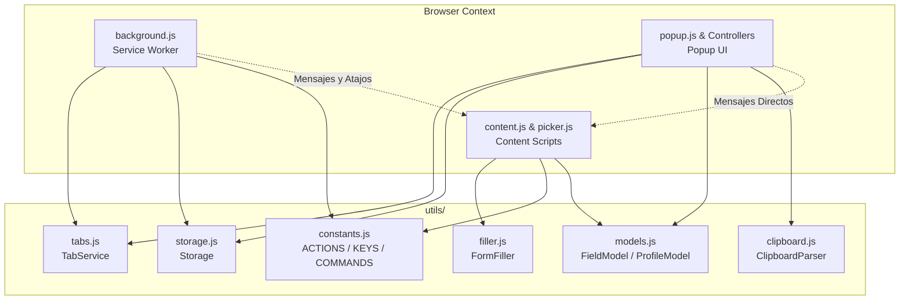

# MultiCopy • v1.0.0 • [Bravo Bytes](https://bravo-bytes.com)

MultiCopy es una extensión para navegadores basados en Chromium (Google Chrome, Microsoft Edge, Brave, Opera, etc.) bajo **Manifest V3** que permite copiar filas desde Excel y rellenar automáticamente cualquier formulario web mediante un sistema inteligente de **perfiles, atajos de teclado y mapeo visual de campos**.

---

## 🚀 Características Principales

1. **Rellenado Instantáneo con Atajo (`Ctrl + Shift + Y` / `Cmd + Shift + Y`):**
   - Rellena formularios directamente desde Excel sin necesidad de abrir la ventana de la extensión.
   - Si la página web no tenía los scripts cargados o se recargó la extensión, el Service Worker los auto-inyecta de forma transparente.
2. **Selector Visual Interactivo ("Elegir campo"):**
   - Vincula columnas de Excel con campos web con un solo clic en la página, sin tocar código ni inspeccionar HTML.
3. **Conversión de Columnas a Letras (`A, B, C...` vs `1, 2, 3...`):**
   - Modela la estructura real de Excel para una configuración intuitiva de las columnas de la fila copiada.
4. **Principio *Fail-Safe* y Coincidencia Bilingüe:**
   - Reconoce sinónimos comunes (ej. `Female` ↔ `Femenino`, `Male` ↔ `Masculino`, `Sí` ↔ `Yes`).
   - Si un dato de Excel es irregular o no existe en la web, **notifica con advertencias claras en vez de ingresar datos erróneos**.
5. **Compatibilidad Total con Frameworks Modernos (React, Vue, Angular):**
   - Modifica valores mediante setters del prototipo nativo (`HTMLInputElement`, `HTMLTextAreaElement`, `HTMLSelectElement`) y dispara eventos sintéticos (`focus`, `input`, `change`, `blur`).
6. **Soporte Completo de Tipos de Formulario:**
   - Inputs (`text`, `email`, `number`, `tel`, `search`, `password`, `date`)
   - Textareas
   - Selects (menús desplegables con búsqueda de opciones)
   - Checkboxes (reconoce valores booleanos: `sí/no`, `true/false`, `1/0`, `x`)
   - Grupos de Radio Buttons (`<input type="radio">` y contenedores)
   - Formatos de fecha (`DD/MM/YYYY`, `DD-MM-YYYY`, `YYYY-MM-DD`)
7. **100% Local y Privado:**
   - Sin servidores externos ni analíticas. Todos los perfiles se guardan en `chrome.storage.local`.

---

## 📁 Estructura del Proyecto

```text
MultiCopy/
├── manifest.json                  # Manifiesto Chrome MV3
├── icons/                         # Iconos oficiales (16, 48, 128)
├── utils/                         # Capa de Lógica y Servicios Compartidos
│   ├── constants.js               # Protocolo de mensajería (ACTIONS), STORAGE_KEYS y COMMANDS
│   ├── models.js                  # Modelos y validación de datos (FieldModel y ProfileModel)
│   ├── storage.js                 # Capa de persistencia con normalización automática
│   ├── tabs.js                    # TabService: gestión de pestañas e inyección garantizada
│   ├── clipboard.js               # Parser TSV y lectura del portapapeles
│   ├── selector.js                # Generador de selectores CSS robustos y nombres amigables
│   └── filler.js                  # FormFiller: motor de rellenado DOM multi-estrategia
├── popup/                         # Interfaz de Usuario (Popup)
│   ├── popup.html                 # Estructura HTML de vistas (Main, Profiles, Fields)
│   ├── popup.css                  # Sistema de diseño Lo-Fi Warm Paper
│   ├── popup.js                   # Coordinador principal ligero de la aplicación
│   └── controllers/               # Controladores modulares por vista
│       ├── main-view.js           # Vista Principal (Portapapeles, selector y rellenado)
│       ├── profiles-view.js       # Vista de Perfiles (Creación, listado y eliminación)
│       └── fields-view.js         # Vista de Campos (Editor de campos, stepper y selector visual)
├── content/                       # Scripts Inyectados en Páginas Web
│   ├── content.js                 # Listener principal de la pestaña y rellenado DOM
│   ├── picker.js                  # ElementPicker: inspector visual y resaltador en pantalla
│   └── content.css                # Estilos del banner flotante, tooltip y toasts en la web
├── background/
│   └── background.js              # Service Worker (atajos globales, auto-inyección y mensajes)
└── test/
    └── test-form.html             # Formulario completo para pruebas y validación local
```

---

## 🏗️ Arquitectura del Sistema

MultiCopy está construido bajo una arquitectura modular y desacoplada compatible con Chrome Manifest V3:



---

## 🧩 Responsabilidades de los Módulos

### 1. Capa de Protocolo y Datos (`utils/`)
- **`constants.js`**: Define las constantes inmutables del protocolo de mensajería (`ACTIONS`), claves de almacenamiento (`STORAGE_KEYS`) y comandos (`COMMANDS`). Previene el uso de cadenas de texto dispersas (*magic strings*).
- **`models.js`**:
  - `FieldModel`: Valida campos, asegura índices de columna numéricos ($\ge 0$) y realiza la conversión bidireccional de columnas a letras (`indexToLetter` / `letterToIndex`).
  - `ProfileModel`: Normaliza perfiles, sanitiza dominios/URLs y comprueba coincidencias con subdominios (`matchesDomain`).
- **`storage.js`**: Centraliza todas las llamadas a `chrome.storage.local` aplicando normalización automática de datos tanto al leer como al guardar perfiles.
- **`tabs.js` (`TabService`)**: Centraliza la consulta de la pestaña activa, el filtro de páginas no inyectables (`chrome://`, `edge://`) y la rutina de verificación e inyección de scripts/estilos.
- **`filler.js` (`FormFiller`)**: Motor que detecta el tipo de control en el DOM y aplica la estrategia de llenado óptima (coincidencia exacta, diccionarios de sinónimos bilingües, formateo de fechas y dispatch de eventos).

### 2. Capa de Interfaz (`popup/`)
- **`popup.js`**: Coordinador principal (~130 líneas). Inicializa controladores, maneja la navegación de vistas (`showView`) y restaura el estado entre aperturas.
- **`controllers/main-view.js`**: Gestiona la lectura del portapapeles, la vista previa de datos, el selector de perfil activo y el feedback del botón de rellenado.
- **`controllers/profiles-view.js`**: Gestiona la creación, listado y eliminación de perfiles.
- **`controllers/fields-view.js`**: Gestiona el formulario de agregar/editar campo, el control stepper de columna (letras o números), el disparo del inspector visual y el listado de campos configurados.

### 3. Capa de Fondo e Inyección (`background/` y `content/`)
- **`background.js`**: Escucha el atajo global `fill-form-shortcut` (`Ctrl+Shift+Y`), localiza el perfil correspondiente (por dominio o activo) y envía la orden a la pestaña. Si el script de la pestaña estaba desincronizado, lo reinyecta automáticamente mediante `TabService`.
- **`content.js`**: Recibe las instrucciones de llenado y ejecuta `fillFormFields()` o coordina la selección visual mediante `ElementPicker`.

---

## 🛠️ Guía de Desarrollo y Buenas Prácticas

Al incorporar nuevas funcionalidades o realizar mantenimiento, sigue estos lineamientos:

1. **Nuevos Mensajes o Acciones:**
   - Agrega siempre la acción en `ACTIONS` dentro de `utils/constants.js`. No uses cadenas de texto literales en `sendMessage` ni en `onMessage`.
2. **Nuevos Atributos en Perfiles o Campos:**
   - Actualiza los métodos `create()` y `normalize()` en `utils/models.js` (`FieldModel` o `ProfileModel`). Esto asegura compatibilidad con perfiles creados anteriormente.
3. **Nuevos Tipos de Controles Web:**
   - Extiende `FormFiller.fillElement()` en `utils/filler.js` siguiendo el principio *fail-safe* (es preferible lanzar un error descriptivo antes que ingresar un dato dudoso).
4. **Nuevas Vistas en el Popup:**
   - Crea un nuevo controlador en `popup/controllers/<nombre>-view.js` y expón un objeto con `init(app)` y métodos de renderizado. Conéctalo desde `popup.js`.
5. **Inyección en Páginas Web:**
   - Si agregas un nuevo archivo utilitario, añádelo tanto al arreglo `js` de `content_scripts` en `manifest.json`, como a la lista `CONTENT_SCRIPTS` en `utils/tabs.js`.
6. **Estilo Visual:**
   - Respeta las variables CSS de la paleta Lo-Fi Paper definidas en `popup/popup.css` (`--bg-paper`, `--bg-card`, `--text-main`, `--accent-yellow-sticky`, etc.).

---

## 🔧 Instalación y Pruebas

1. Abre Google Chrome o Microsoft Edge y navega a `chrome://extensions/`.
2. Activa el **Modo de desarrollador** (esquina superior derecha).
3. Haz clic en **Cargar descomprimida** y selecciona la carpeta raíz del proyecto (`MultiCopy`).
4. Abre el archivo de prueba `test/test-form.html` en el navegador para verificar la vinculación visual, el rellenado con botón y el rellenado con atajo (`Ctrl + Shift + Y`).

---

## 🛡️ Privacidad y Seguridad

- **0 dependencias externas:** No requiere librerías pesadas ni conexiones externas.
- **Sin telemetría ni analíticas:** Todo el procesamiento ocurre de manera local y aislada en el navegador del usuario.

---

Desarrollado con ❤️ por [Bravo Bytes](https://bravo-bytes.com).
